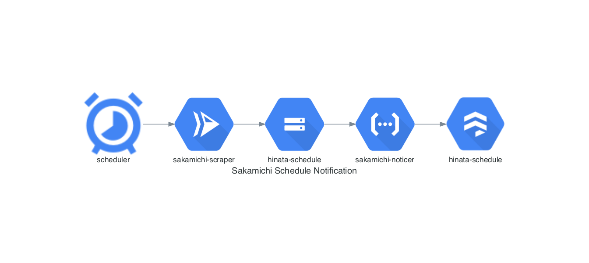

# Sakamichi Schedule Notification

- 坂道グループのスケジュールを公式サイトから収集し、新規のスケジュールをLINEで通知します。

## Architecture

- Cloud Schedule 坂道グループのスケジュールをスクレイピング

## Each Projects

### architecture_diagram

- アーキテクチャ図を作成します。

#### 使用技術
- [Python](https://www.python.org/)
- [Poetry](https://python-poetry.org/)
- [Diagrams](https://diagrams.mingrammer.com/)

### sakamichi_infra

- インフラ構築に関するコード類を格納します。

#### 使用技術
- [Terraform](https://www.terraform.io/)
- [Google Cloud Platform](https://console.cloud.google.com/?hl=ja)
  - [Cloud Storage](https://cloud.google.com/storage/)
  - [Identity and Access Management (IAM)](https://cloud.google.com/iam/)
  - [App Engine](https://cloud.google.com/appengine)

### sakamichi_noticer

- 収集された坂道グループのスケジュールから通知を行います。

#### 使用技術
- [Java](https://www.java.com/ja/)
- [Maven](https://maven.apache.org/)
- [Spring Cloud Function](https://spring.io/projects/spring-cloud-function)
- [Jackson](https://github.com/FasterXML/jackson)
- [JUnit](https://junit.org/junit5/)
- [AssertJ](https://assertj.github.io/doc/)
- [mockito](https://site.mockito.org/)

### sakamichi scraper

- 坂道グループのスケジュールを収集します。

#### 使用技術
- [Python](https://www.python.org/)
- [Poetry](https://python-poetry.org/)
- [Scrapy](https://scrapy.org/)
- [Scrapyrt](https://github.com/scrapinghub/scrapyrt)
- [Docker](https://www.docker.com/)
- [Google Cloud Platform](https://console.cloud.google.com/?hl=ja)
  - [Cloud Run](https://cloud.google.com/run)
  - [Cloud Scheduler](https://cloud.google.com/scheduler)