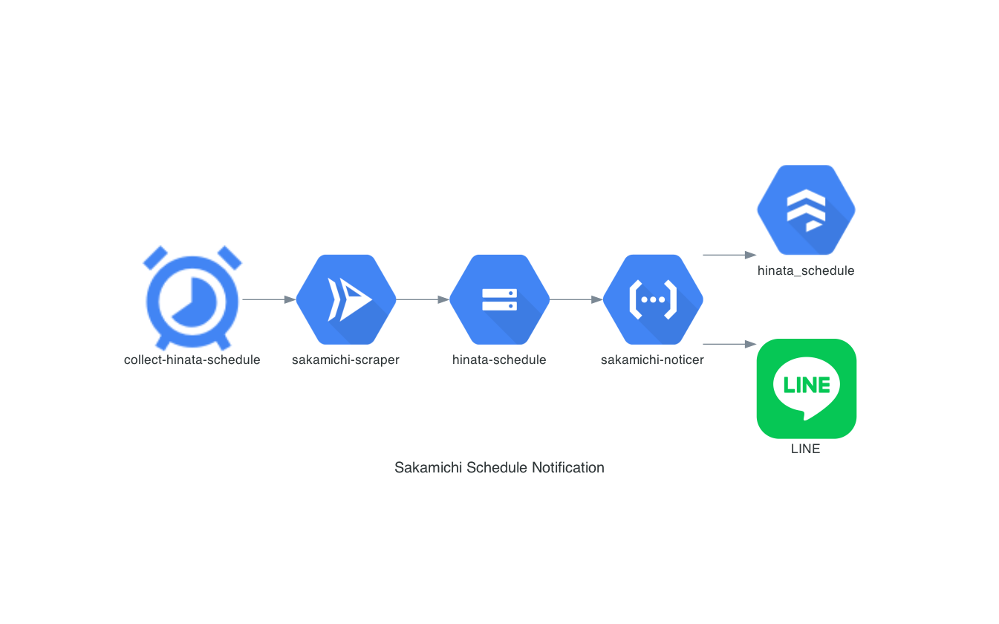

# Sakamichi Schedule Notification

- 坂道グループのスケジュールを公式サイトから収集し、新規のスケジュールをLINEで通知します。

## Architecture

| Resource                | Service         | Overview                                                        |
|-------------------------|-----------------|-----------------------------------------------------------------|
| collect-hinata-schedule | Cloud Scheduler | 定期的に sakamichi-scraper の処理を呼び出します。                       |
| sakamichi-scraper       | Cloud Run       | 公式サイトから情報を取得し、Cloud Storage に保存します。                     |
| hinata-schedule         | Cloud Storage   | スケジュール情報を保管します。                                             |
| sakamichi-noticer       | Cloud Functions | スケジュール情報の保管をトリガーとして Datastore への情報の登録、LINE の通知を行います。 |
| hinata_schedule         | Cloud Datastore | スケジュール情報を保管します。                                             |

## Each Projects

### architecture_diagram

- アーキテクチャ図を作成します。

#### 使用技術
- [Python](https://www.python.org/)
- [Poetry](https://python-poetry.org/)
- [Diagrams](https://diagrams.mingrammer.com/)

### sakamichi_infra

- インフラ構築に関するコード類を格納します。

#### 使用技術
- [Terraform](https://www.terraform.io/)
- [Google Cloud Platform](https://console.cloud.google.com/?hl=ja)
  - [Deployment Manager](https://cloud.google.com/deployment-manager)
  - [App Engine](https://cloud.google.com/appengine)
  - [Cloud Run](https://cloud.google.com/run)
  - [Cloud Scheduler](https://cloud.google.com/scheduler)
  - [Cloud Storage](https://cloud.google.com/storage/)
  - [Identity and Access Management (IAM)](https://cloud.google.com/iam/)
  - [Secret Manager](https://cloud.google.com/secret-manager)
- [just](https://github.com/casey/just)

### sakamichi_noticer

- 収集された坂道グループのスケジュールのデータ保存および更新通知を行います。

#### 使用技術
- [Java](https://www.java.com/ja/)
- [Maven](https://maven.apache.org/)
- [Spring Boot](https://spring.io/projects/spring-boot)
- [Spring Cloud Function](https://spring.io/projects/spring-cloud-function)
- [Spring Cloud GCP](https://spring.io/projects/spring-cloud-gcp)
- [LINE Messaging API SDK for Java](https://github.com/line/line-bot-sdk-java)
- [Jackson](https://github.com/FasterXML/jackson)
- [JUnit](https://junit.org/junit5/)
- [AssertJ](https://assertj.github.io/doc/)
- [mockito](https://site.mockito.org/)
- [JSpecify](https://jspecify.dev/)
- [Lombok](https://projectlombok.org/)

### sakamichi scraper

- 坂道グループのスケジュールを収集します。

#### 使用技術
- [Python](https://www.python.org/)
- [Poetry](https://python-poetry.org/)
- [Scrapy](https://scrapy.org/)
- [Scrapyrt](https://github.com/scrapinghub/scrapyrt)
- [Docker](https://www.docker.com/)
